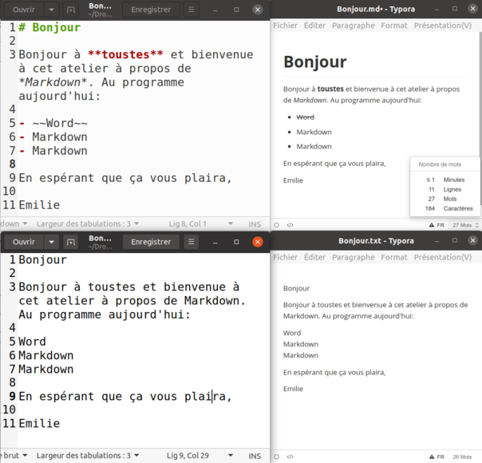
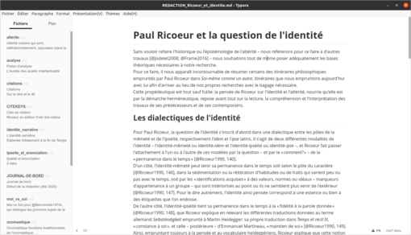
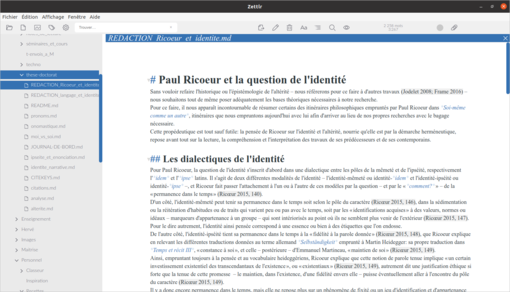
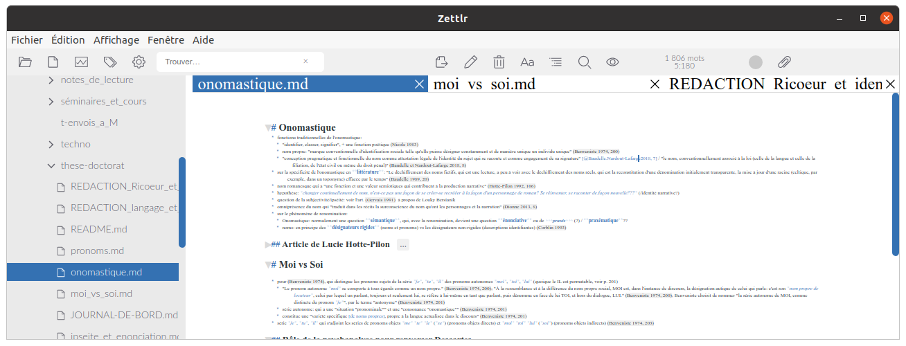
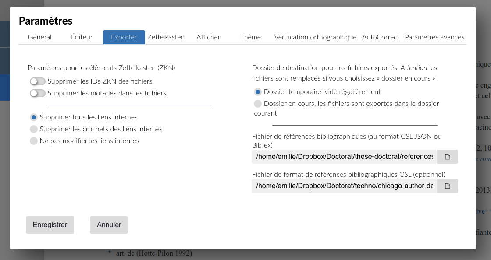
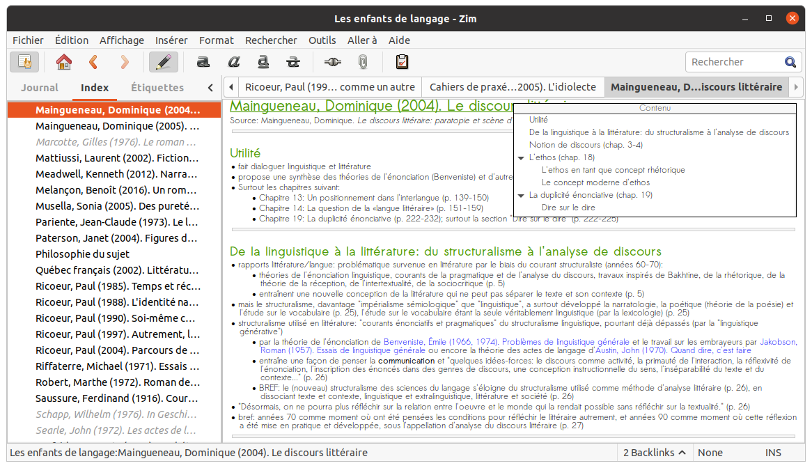

% Markdown: quoi? pourquoi? comment?
% Atelier présenté pour les *Chercheuses badass*
% 21 octobre 2020

---

# Plan de l'atelier
1. **Quoi?**: L'idée derrière Markdown
2. **Comment?**: La *syntaxe* Markdown
3. **Pourquoi?**: Mon utilisation de MD

Note: les diapositives ont été rédigées en Markdown et converties vers du HTML via Pandoc.

La documentation de cet atelier est [disponible en ligne](https://github.com/emidrouin/atelier-markdown)

---

# Qu'est-ce que Markdown
- langage de **balisage** (*markup language*)
	- langage de balisage **léger** (*lightweight*)
- créé en 2004 (John Gruber et Aaron Swartz)
- caractéristiques:
	- facilité
	- lisibilité
	- (ex)portabilité

---

# Qu'est-ce que c'est?

## Ce que je veux:
- métadonnées du titre (Hola), sur l'autrice (Emilie Drouin) de la page et la date (Octobre 2020)
- Une ligne de texte avec de l'*italique* et du **gras**

## Ce que j'écris en markdown:

    % Hola
    % Emilie Drouin
    % Octobre 2020
    *Hola!* Mon nom est **Emilie**.

ou même, si l'on n'a pas besoin des métadonnées (titre, autrice, date):

    *Hola!* Mon nom est **Emilie**.

## Ce que j'obtiens:

*Hola!* Mon nom est **Emilie**.

---

# Qu'est-ce que ce n'est pas...

Ce n'est ni du HTML, ni LaTeX, qui sont d'autres langages de balisage.

## Ce n'est pas du HTML

Pour obtenir "*Hola!* Mon nom est **Emilie**.":

	<html>
		<head>
			<title>Hola</title>
			<meta name="author" content="Emilie Drouin">
			<meta name="date" content="Octobre 2020">
		</head>
		<body>
			
<i>Hola!</i> Mon nom est <b>Emilie</b>.

		</body>
	</html>

HTML est conçu pour le web.

---

## Ce n'est pas LaTeX

Pour obtenir "*Hola!* Mon nom est **Emilie**.":

    \documentclass{article}
    \title{Hola}
    \author{Emilie Drouin}
    \date{Octobre 2020}
    \begin{document}
       \maketitle
       \textit{Hola!} Mon nom est \textbf{Emilie}.
    \end{document}

LaTeX est beaucoup utilisé pour la rédaction (articles, livres, thèses) orientée vers une publication par impression (papier ou écran, par exemple PDF).

---

# Pis Word?????????? Ça va tellement bien Word!!

Deux mots:  
- liberté
- indépendance

---

## Liberté
- la question du "libre"
	- le *par* et *pour* la communauté
	- accès libre (*open access*) en publication savante... et ensuite?
	- informatique libre
		- logiciels libres, gratuits, propriétaires???
			- propriétaire = Endnote (Clarivate Analytics), Mendeley (acheté par Elsevier); Word (Microsoft), Pages (Apple), Google Doc (Google); Internet Explorer (Microsoft), Safari (Apple), Chrome (Google); Windows (Microsoft); macOS et iOS (Apple\*); Android (Google\*)
			- libre = Zotero; LibreOffice; Firefox (Mozilla Foundation); Noyau Linux
		- LibreOffice comme alternative (libre) à Word

---

## Indépendance
- la question des outils et des formats
	- les formats
		- .docx
		- .odt
		- .txt
		- .md
		- ...
	- les outils
		- la dépendance aux outils
		- l'interopérabilité (compatibilité, portabilité)

---

## Dans les entrailles d'un .docx

---

## Dans les entrailles d'une recette.md

---

## WYSIWYM vs WYSIWYG

- **What You See Is What You Get** ("tel écran, tel écrit")
	- rendu graphique (*visual*) orienté vers un support prévu (feuille, page web)
- **What You See Is What You Mean**

---

## Retour sur les caractéristiques de Markdown

1. facilité
	- facile à écrire, facile à lire
2. simplicité
	- juste le nécessaire: repérage (titres), organisation (listes)
3. (ex)portabilité
	- lisible en l'état (en plein texte - *plain text*); ne requiert pas d'outil (logiciel) spécifique

---

## Hein?? pas d'outil spécifique?

Markdown est une **syntaxe** qui ne dépend pas d'un logiciel, ni pour l'écriture, ni pour la lecture (car il est **lisible en l'état**, c'est-à-dire que la **syntaxe** est si **légère** qu'elle n'interfère pas lors de la lecture humaine).

### On écrit/lit ça où, du Markdown?
- éditeurs plein-texte (format: .txt) ou des éditeurs de texte génériques
  - de base dans chaque système d'exploitation (*OS*): Bloc-notes / *Notepad* (Microsoft), TextEdit (Apple), gedit (de base dans Linux mais multi plate-forme)
  - plus complets et plus complexes: Atom (libre, multi plate-forme), NotePad++ (libre, pour Windows), Sublime Texte (propriétaire, multi plate-forme)
  - ultra léger: Geany (libre, multi plate-forme)
- éditeurs Markdown (format: .md)
	- *parser* (analyseurs syntaxiques)
	- outils plus complexes et plus puissants

---

## Des formats et des outils: langages et éditeurs

---

### Vraiment pas d'outils?

AH. Alors il y en a, des outils! Oui, mais le fichier Markdown ***n'en dépend pas***; il est aussi lisible *à l'extérieur* de ces outils (logiciels), et à l'inverse, il peut être écrit hors du logiciel puis lu (*parsé*, interprété) à l'intérieur.

``"Que tu le manges avec une fourchette ou une cuillère, l'important, ce n'est pas l'ustensile, c'est le gâteau!"`` -\ moi-même

### Avantages de cette indépendance face aux outils

- pérennité
	- changement de système d'exploitation (Windows <-> Mac <-> Linux)
	- changement de logiciel
	- changement de version (mise à jour)
- stabilité
	- transfert inter-logiciel d'un fichier
	- co-écriture inter-logicielle ou inter-OS
- **export**abilité, **import**abilité ou **trans**portabilité?
	
---

# La syntaxe Markdown

## Qu'est-ce que Markdown permet?

Markdown permet un certain degré de mise en forme très facile à faire *on the fly*: gras, italique, titres et sous-titres, listes à puces.

C'est ce qui en fait une syntaxe aussi appropriée pour la **prise de notes**. Plus simple/facile que Word/LibreOffice, mais plus complet (niveau mise en forme) que du simple texte (.txt). Si l'on ajoute ses qualités de pérennité et de stabilité, ça en fait la syntaxe parfaite pour la **conservation** de ces mêmes **notes**.

---

### Emphase
*Italique*: ``*italique*`` ou ``_italique_`` (1 underscore)  
**Gras**: ``**gras**`` ou ``__gras__`` (2 underscores)  
***Gras et Italique***: ``***gras-italique***`` ou ``___gras-italique___`` (3 underscores)  

### Niveaux de titres (*Headings*)
Titre 1: ``# Titre 1``  
Titre 2: ``## Titre 2``  
Titre 6: ``###### Titre 6``  

- relève d'un balisage **sémantique**
	- on ne demande pas une *apparence* précise (taille 16, caractère gras!); plutôt, on indique de quel niveau de titre ça relève (autrement dit, le *sens* ou la *fonction* de ce contenu)
	- semblable aux Titres dans Word/LibreOffice (mais beaucoup plus rapide/facile à taper!)
	
---

### Listes à puces
- listes numérotées:
	- utiliser des chiffres (``1.``, ``2.``...)
	- les chiffres indentés (en utilisant une tabulation, et recommençant la numérotation) deviendront des sous-points
- listes non-ordonnées:
	- en utilisant des symboles: tiret (``-``), astérisque (``*``) ou signe d'addition (``+``)

### Mise en page
- Changement de paragraphe: laisser une ligne vide  
- Retour à la ligne (sans changer de paragraphe): terminer une ligne par un double espacement *forcera* le retour à la ligne
- Utiliser un caractère qui donnerait autrement du code: mettre un backslash (``\``) avant
- ###### Quand tu ~~corriges ton erreur~~ changes d'idée: ``~~barré~~``

---

## Ressources à propos de la syntaxe Markdown
- Pour un essai rapide: [Markdown tutorial](https://www.markdowntutorial.com/)
- Syntaxe de base: [Markdown guide](https://www.markdownguide.org/basic-syntax/)
- Aide-mémoire (en ligne ou à télécharger): [Cheatsheet de Markdown guide](https://www.markdownguide.org/cheat-sheet/)

---

## Mon utilisation

Préambule:  
- discipline: littérature
- lectures: principalement papier, parfois à l'écran (PDF scannés, surtout)
- plateformes utilisées pour prendre des notes et rédiger: ordinateur portable sur Linux; tablette Android (+ clavier Bluetooth)

Utilisation au fil du temps:  
- prise de notes (cours, conférences)
- prise de notes de lecture (préparation à l'examen de synthèse)
- rédaction (premier jet)

---

## Éditeurs Markdown

- Typora
- Zettlr
- ...
- mais il y en a des quantités d'autres, certains plus légers (*lightweight*), d'autres seulement pour une plateforme (Mac ou Windows), certains en ligne (*in-browser*), certains qui sont libres et d'autres non!

---

## Typora
- probablement le plus répandu à l'heure actuelle
- malheureusement pas libre ni ouvert
- malgré tout un excellent éditeur Markdown
- disponible ici: [Typora.io](https://typora.io/)

---

## Zettlr
- éditeur Markdown orienté pour l'**écriture académique** (!!!)
- intégration avec Zotero (!!!!!)
- libre et ouvert (!!!!!!!)
- disponible ici: [Zettlr.com](https://zettlr.com/)

---

### Zettlr comme outil de prise de notes
- arborescence (liste des dossiers et des fichiers; niveaux de titres dans le fichier)
- onglets multiples, moteur de recherche

---

### Zettlr comme outil de rédaction
- mode sans distraction (fermer le menu des dossiers)
- mode de lisibilité (algorithme de mise en évidence syntaxique selon la complexité de la phrase)

---

### Intégration Zotero

#### Bibliothèque de références
- exporter la bibliothèque à partir de Zotero
	- Clic droit sur "Ma bibliothèque" - Exporter la bibliothèque - format: Better BibTex; cocher "Garder à jour"
	- résultat: un fichier .bib à l'endroit que vous voulez
- pointer vers ce fichier (qui se mettra à jour automatiquement) dans Zettlr
	- Fichier - Paramètres - Exporter - "Fichier de références bibliographiques"

#### Format des références
- choisir et télécharger la feuille de styles de votre choix [à partir du Zotero Style Repository](https://www.zotero.org/styles)
- pointer vers la feuille de styles que vous avez téléchargée dans Zettlr
	- juste en-dessous de l'endroit où vous pointez vers votre fichier .bib

---

#### Pour citer
- à partir de Zettlr: Simplement utiliser @, et sélectionner le texte dans le menu défilant
- ce qui apparaîtra enversion plein-texte:
	- référence à l'ouvrage entier: ``@handle``
	- référence spécifique: ``[@handle, 99]``
- la clé de citation (*handle*) est automatiquement produite par Zotero, mais vous pouvez la modifier, ou même établir une nouvelle syntaxe avec le plugin Better BibTex pour Zotero, pour qu'elle se fasse à votre goût (Édition - Préférences - Better BibTex - Format de clé); mon format de clé: ``[auth.etal][origyear]|[auth.etal][year]``
	
---

---

### Prise de notes pour l'examen de synthèse
- un fichier par ouvrage qui était sur ma liste
	- nom du fichier: AUTEURICE_2134.md
	- Titre 1 (``# Titre``): AUTEURICE (2134). Titre de l'ouvrage
	- recopier les extraits/citations d'intérêt (réf: numéro de page entre parenthèses)
	- indiquer ma propre réflexion lors de la lecture (réf: mes initiales entre parenthèses), de même que les liens que je voyais avec d'autres ouvrages ou théories
	

(À l'époque de la préparation de mon examen, Typora n'était pas aussi développé/puissant qu'aujourd'hui et Zettlr n'existait pas; d'où mon choix de Zim-wiki, qui s'écrit dans un hybride de Markdown. Le principe reste importable dans Zettlr, Typora ou autre.)
	
---

---

### Et sur la tablette?

---

## Merci!

Documentation de l'atelier de ce soir: [mon Github](https://github.com/emidrouin/atelier-markdown)

Mes projets: [page web perso (dont le contenu est écrit en Markdown!)](https://emidrouin.ca/)

